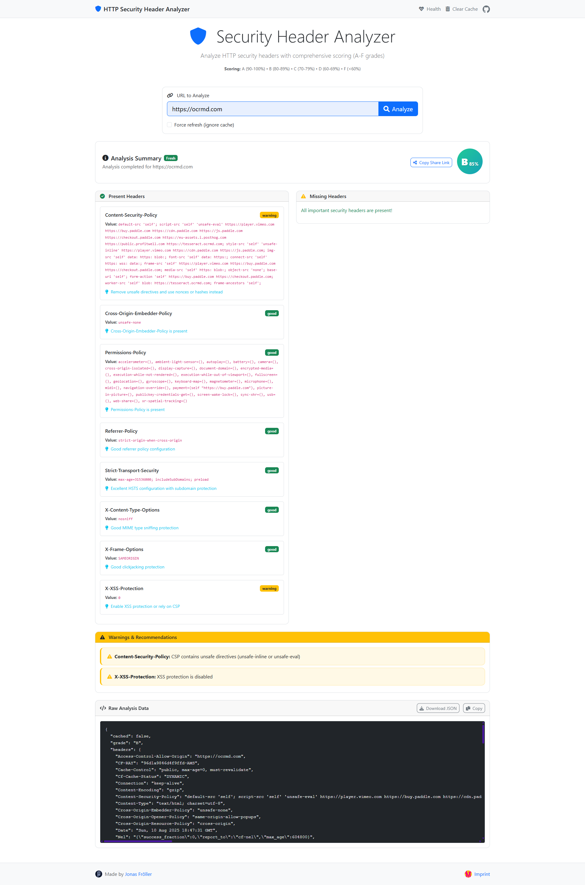

# HTTP Security Header Analyzer

## Overview

This is a Flask-based web application that provides a web interface and REST API to analyze HTTP security headers. It helps developers and security professionals assess the security posture of web applications.  
The system is designed as a simple, lightweight service that performs live HTTP header analysis and presents results through a user-friendly web interface with caching and rate limiting capabilities.



## System Architecture

### Frontend Architecture

- **Technology**: Vanilla JavaScript with Bootstrap for UI components
- **Design Pattern**: Single-page application with dynamic content loading
- **Styling**: Bootstrap dark theme with custom CSS for security grades and smooth animations
- **User Interface**: Clean, responsive design with real-time analysis feedback and shareable results
- **Sharing Feature**: URL-based result sharing with automatic clipboard copy functionality

### Backend Architecture

- **Framework**: Flask (Python) with modular service architecture
- **Design Pattern**: Service-oriented architecture with separation of concerns
- **Core Services**:
  - `HumbleService`: Handles HTTP security header analysis with automatic protocol fallback (HTTPS→HTTP)
  - `CacheService`: Provides in-memory caching with TTL support for performance optimization
  - `URLValidator`: Handles URL validation, normalization, and protocol detection
- **Rate Limiting**: Flask-Limiter integration for API protection
- **Security**: ProxyFix middleware for proper header handling behind proxies

### Data Flow

1. User submits URL through web interface or API (or loads shared URL)
2. URL validation and normalization with automatic protocol detection (HTTPS preferred)
3. Cache check for existing results
4. Analysis executed by humble CLI (brief JSON) with optional HTTPS→HTTP fallback
5. Result mapping to UI/API schema and caching
6. Response delivery
7. Optional shareable URL for results

### Error Handling

- Network timeout handling for HTTP requests
- Comprehensive input validation and sanitization
- Rate limiting with meaningful error responses

## External Dependencies

### Core Dependencies

- **Flask**: Web framework for API and web interface
- **Flask-Limiter**: Rate limiting middleware
- **Werkzeug**: WSGI utilities and middleware
- **Bootstrap**: Frontend CSS framework via CDN
- **Font Awesome**: Icon library via CDN

### Security Analysis Engine

- **humble CLI (only)**: The application relies exclusively on the official humble analyzer for checks, grading, and summaries.

Configuration for humble:

- Set one of the following environment variables so the app can locate humble:
  - `HUMBLE_PY`: Full path to `humble.py` (e.g., `D:/tools/humble/humble.py`)
  - `HUMBLE_HOME`: Directory containing `humble.py` (e.g., `D:/tools/humble`)
- Optional: `PYTHON_LAUNCHER` to override the Python executable used to run humble (defaults to `py` on Windows, `python3` on Linux/macOS)

Installation of humble (from source) summary:

```bash
git clone https://github.com/rfc-st/humble.git
cd humble
pip install -r requirements.txt
# then set HUMBLE_HOME to this directory or HUMBLE_PY to its humble.py
```

### Runtime Dependencies

- **Python requests library**: For making HTTP requests to analyze security headers
- **Threading**: For thread-safe cache operations
- **JSON**: For parsing analysis results and API responses

### External Services

- **CDN Resources**: Bootstrap CSS and Font Awesome icons loaded from external CDNs
- No database dependencies (uses in-memory caching)
- No external API dependencies

### Environment Configuration

- `SESSION_SECRET`: Flask session secret key (defaults to development key)
- Rate limiting configuration through Flask-Limiter
- Logging configuration set to DEBUG level for development

## Run frontend and backend together

The Flask app serves both the API and the web UI (from `templates/` and `static/`). Start the server with one of the following single commands:

- Using Python (recommended):
  
  ```bash
  python main.py
  ```

- Using Flask CLI (auto-reload):
  
  ```bash
  python -m flask --app app run --debug
  ```

- Using uv (if installed):
  
  ```bash
  uv run python main.py
  ```

Then open http://localhost:5000 in your browser.

### Zero-friction setup with uv

```bash
uv sync --frozen --no-dev
# Option A: vendor humble once (recommended)
git clone https://github.com/rfc-st/humble.git .tools/humble
# Windows PowerShell
$env:HUMBLE_HOME = "$PWD/.tools/humble"
# macOS/Linux
export HUMBLE_HOME="$PWD/.tools/humble"

uv run python main.py
```

Notes:
- The app auto-discovers `.tools/humble/humble.py` or `vendor/humble/humble.py` if `HUMBLE_HOME`/`HUMBLE_PY` is not set.
- If you prefer an isolated interpreter for humble, create a venv under `.tools/humble/.venv` and set `PYTHON_LAUNCHER` to that interpreter path. Otherwise the app uses the current `sys.executable`.

API response shape (humble-only, abbreviated):
- url, status_code, timestamp, scan_time, cached
- headers: raw response headers
- grade (A–F), score, analysis_source="humble"
- security_headers: object keyed by header name with present/value/status
- missing_headers: array of header names
- warnings: array of {header, message}
- humble: passthrough of parsed humble output with:
  - present_headers, missing_headers, deprecated_or_insecure, fingerprint_headers, empty_values
  - info, browser_compat, browser_compat_map, analysis_results_lines, analysis_runtime_seconds
  - totals (numeric counts), grade, raw_object, source

## Production Deployment

Use uv to install dependencies, then run the app with a production WSGI server (Gunicorn) behind a reverse proxy.

1) Install dependencies (prod)

```bash
uv sync --frozen --no-dev
```

2) Run with Gunicorn (Linux)

```bash
export SESSION_SECRET="<your-strong-secret>"
gunicorn -w 4 -k gthread -b 0.0.0.0:8000 app:app
```

3) Reverse proxy (Nginx)

```nginx
location / {
  proxy_pass http://127.0.0.1:8000;
  proxy_set_header Host $host;
  proxy_set_header X-Forwarded-For $proxy_add_x_forwarded_for;
  proxy_set_header X-Forwarded-Proto $scheme;
}
```

Notes:
- Gunicorn is not supported on Windows; for local Windows use WSL or a Windows-friendly server (e.g., waitress). For real prod, prefer Linux.
- Set `SESSION_SECRET` in production.

### Install dependencies (first run)

If you don't use `uv`, install the minimal runtime deps with pip:

```bash
python -m pip install --upgrade pip
pip install flask flask-limiter werkzeug requests
```

Optional extras in `pyproject.toml` (e.g., `gunicorn`, `flask-sqlalchemy`) are not yet required to run this app.
